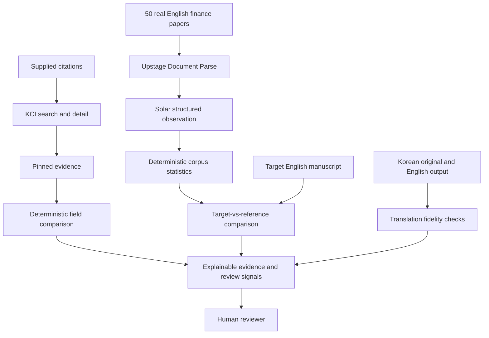

# TrustVerify Research

TrustVerify Research is a NAIS hackathon project for explainable research-reference checks and review of academic English. It produces evidence and review signals for a human reviewer. **The system does not determine manuscript acceptance.**

## Problem 1 — Citation integrity

AI-generated research references may contain the wrong title, author, year, or DOI. A reference may also mix metadata from multiple real papers into one apparently plausible citation. Reviewers need to see which fields agree with a real source record, which differ, and where evidence is insufficient.

## Problem 2 — Meaning and scholarly communication

Korean research translated or generated into English may preserve the topic while distorting modality, causality, uncertainty, or academic style. For example, a tentative association can become an asserted causal effect. Such changes can make a manuscript unsuitable for scholarly communication even when its general subject remains recognizable.

Translation fidelity and resemblance to a domain's writing conventions are separate questions. Both need evidence that a reviewer can inspect.

## Implementation plan

| Track | Planned pipeline | Review output |
| --- | --- | --- |
| **A — Citation Integrity** | KCI Open API → search/detail → pinned evidence → deterministic field comparison → explainable finding | Source-backed agreements, mismatches, and unresolved citation identities |
| **B — Academic English Reference Profile** | 50 real English finance papers → Upstage Document Parse → Solar structured observation → deterministic corpus statistics → target-vs-reference comparison | Descriptive differences between a target manuscript and the Finance-50 reference distribution |
| **C — Translation Fidelity** | Korean original vs English output → numbers / citations / entities / negation / modality / causality checks → review signals | Traceable potential meaning changes in aligned source and output passages |

**The Finance-50 corpus is a domain reference distribution, not a universal definition of good academic writing.** Differences from that corpus do not establish poor quality, mistranslation, or a reason to reject a manuscript. Corpus composition, section type, and limitations must accompany comparisons.



## Current status

The KCI runtime adapter now implements search/detail requests, fail-closed envelope classification, normalization of observed fields, and redacted snapshot persistence. The isolated qualification probe and its evidence remain separate. KCI received **YELLOW**: the observed API supports bibliographic evidence, with snapshot precautions and strict response validation required. Search/detail lookup was confirmed using the actual `articleInfo/@article-id` field.

The full three-track product pipelines above remain plans. Citation comparison and findings are not implemented; the adapter returns internal KCI states and eligibility flags only. The Finance-50 corpus has not been established by this repository, and Upstage Document Parse, Solar analysis, translation checks, comparison engines, and application UI are not implemented.

A valid zero-result KCI search is eligible only for a future `NOT_FOUND_IN_KCI` finding; it does not prove a fake paper or hallucination. API and parsing failures remain separate from citation findings. **KCI is the primary canonical bibliographic evidence source for this prototype; it does not prove scientific truth.** ScienceON remains a possible future second source only if KCI coverage is insufficient. NTIS is excluded from the current prototype.

## Run the offline adapter tests

Use Node.js 24 or later:

```sh
npm ci --ignore-scripts
npm test
```

Tests use the committed redacted qualification fixtures and synthetic transport responses. They require no API credential and make no live KCI calls. See the [runtime adapter contract](docs/KCI_ADAPTER.md) for server-side usage, state definitions, normalization, and snapshot handling.

## Documentation and repository layout

- [Architecture and evidence contracts](docs/ARCHITECTURE.md)
- [KCI qualification summary](artifacts/api-qualification/kci/SUMMARY.md)
- [Observed KCI field map](artifacts/api-qualification/kci/field-map.md)
- [Citation finding and system-failure contracts](docs/FINDING_CONTRACT.md)
- `src/kci/adapter.js`: runtime adapter and explicit redacted snapshot persistence.
- `test/kci.test.js`: offline fixture, failure-boundary, transport and audit tests.
- `tools/api-probe/kci/`: isolated qualification and offline verification scripts, separate from future product runtime.
- `artifacts/api-qualification/kci/`: minimal redacted qualification snapshots and findings.

## Data boundaries

Keep API credentials in ignored local configuration. Never commit secrets, credential-bearing request URLs, or authorization headers. KCI echoes credentials in responses, so redact before saving evidence.

Do not include raw copyrighted PDFs or full paper text in this repository. The planned Finance-50 workflow requires lawfully accessible source material and permission appropriate to processing; public outputs should use permitted bibliographic metadata, derived observations, aggregate statistics, and minimal evidence excerpts only where permitted. Manuscript and source-text handling must respect access and retention constraints.
