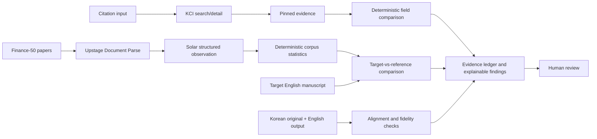

# TrustVerify Research architecture

This document defines the implementation plan. The repository currently contains a KCI qualification probe and redacted API evidence, not the product pipelines described here. This documentation task adds no new features.

The system addresses two problems: unreliable metadata in AI-generated references, and English translations or generated manuscripts that preserve a Korean research topic while changing meaning or scholarly expression. It returns explainable evidence and review signals. Human reviewers retain the final decision; the system does not determine manuscript acceptance.

## Planned architecture

Each track answers a distinct question. Track A compares bibliographic metadata with KCI evidence. Track B describes how a target differs from a finance-domain reference distribution. Track C checks whether English output preserves the Korean original. A finding in one track must not substitute for evidence in another.

## Track A — Citation Integrity

Pipeline: **KCI Open API → search/detail → pinned evidence → deterministic field comparison → explainable finding**.

1. Preserve the supplied citation and its field locations. Search KCI for candidate records, validate the response envelope, and fetch detail using the observed `articleInfo/@article-id` as the request `id`.
2. Pin the evidence used in the decision. Preserve original source paths and distinguish missing fields from empty or conflicting values. Use the [observed field map](../artifacts/api-qualification/kci/field-map.md), rather than assuming API fields.
3. Establish coherent record identity before comparing supplied title, authors, year, DOI and other available bibliographic fields. Record the versioned normalization and comparison rules. Do not invent similarity thresholds before evaluation.
4. Emit a finding containing the supplied value, KCI value, source record, rule, result, limitations, and human review recommendation.

| Planned citation status | Evidence requirement |
| --- | --- |
| `VERIFIED` | One coherent KCI record supports the important supplied metadata; this does not verify scientific claims |
| `METADATA_DRIFT` | Coherent identity is established, but supplied metadata differs from the record |
| `CHIMERA` | Strong field-level evidence maps the supplied citation to multiple distinct real records; use conservatively |
| `REVIEW_REQUIRED` | Identity, matching evidence, or interpretation is weak, incomplete, or ambiguous |
| `NOT_FOUND_IN_KCI` | A validated successful search returns the recognized zero-result shape; limited to query and coverage |

System failures remain separate: `KCI_UNAVAILABLE`, `KCI_AUTH_FAILED`, `KCI_INVALID_RESPONSE`, and `KCI_PARSE_FAILED`. No failure becomes a zero result. The qualification observed HTTP 200 for both valid zero results and invalid input. A valid zero response used `resultMsg=No Data` with no total or records; missing totals alone are insufficient. See the [qualification summary](../artifacts/api-qualification/kci/SUMMARY.md) for tested behavior and untested error families.

KCI remains the canonical citation evidence source. ScienceON is a future option only if KCI coverage is insufficient; NTIS is excluded from the current prototype. Source coverage does not establish whether a paper exists everywhere, and KCI's own `verified` field is not the application's `VERIFIED` finding.

## Track B — Academic English Reference Profile

Pipeline: **50 real English finance papers → Upstage Document Parse → Solar structured observation → deterministic corpus statistics → target-vs-reference comparison**.

The planned Finance-50 corpus needs a versioned manifest identifying 50 real papers, bibliographic provenance, selection criteria, available sections, and processing permissions. Collection and selection are not yet implemented. Record its disciplinary, publication-period, and section coverage so users can interpret the distribution.

Upstage Document Parse is the planned document-structure extraction stage. Solar is the planned structured-observation stage: it should produce schema-constrained observations tied to section or passage locations, such as modality, uncertainty, causal language and academic-style patterns. These are proposed observation categories, not claims about native API response fields. Parser output and model observations require validation; missing or uncertain observations must remain visible.

Deterministic code will aggregate validated observations into counts, rates with explicit denominators, and distributions. Define the unit of analysis and avoid silently letting longer papers dominate the reference profile. Apply the same versioned observation definitions to the target manuscript and compare compatible sections and measures. Preserve extraction/model/prompt versions and pinned observations for audit.

**Finance-50 is a domain reference distribution, not a universal definition of good academic writing.** Corpus differences are descriptive review signals, not acceptance scores. A limited finance corpus may not represent other disciplines, genres, methods, or journals. Model observations may vary between runs: deterministic aggregation means reproducibility from fixed validated inputs, not deterministic model behavior. No corpus, scoring system, thresholds, or service integration is implemented by this plan.

## Track C — Translation Fidelity

Pipeline: **Korean original vs English output → numbers / citations / entities / negation / modality / causality checks → review signals**.

Preserve document versions and align corresponding passages before comparison. Support split or merged sentences and explicitly surface uncertain alignment. If the Korean original is unavailable, report fidelity as unassessed; stylistic similarity cannot replace a source comparison.

| Check | Planned evidence and review signal |
| --- | --- |
| Numbers | Compare values, signs, units, percentages and ranges; explain any normalization |
| Citations | Compare retained, omitted, added or reassigned citations; source existence remains Track A's responsibility |
| Entities | Compare names, organizations and technical terms while allowing documented transliteration or abbreviation |
| Negation | Flag potential loss, addition or scope change of a negative proposition |
| Modality | Flag changes in possibility, obligation or certainty, including weakened uncertainty |
| Causality | Flag association becoming causation or changes in causal direction or strength |

Use deterministic comparisons for explicit comparable values where possible. Semantic judgments about negation scope, modality and causality require contextual evidence and human review; this plan does not claim that lexical matching proves equivalence. Explain each signal with aligned source/output locations, the compared observations, a rule or check identifier, and uncertainty. Academic-style resemblance from Track B must not justify changing the original claim.

## Shared evidence and explanation contract

Every planned finding should expose:

- Track and check/rule ID, including its version.
- Input document version and location, supplied value or structured observation.
- Evidence provenance: KCI record and field path, corpus manifest/observation reference, or aligned Korean/English locations.
- Comparison, result, missing evidence, uncertainty and human review recommendation.
- Retrieval/processing timestamp and links to pinned evidence hashes.

For KCI, proposed ledger values include `source_system=KCI`, `source_record_id` derived from the actual article attribute, `retrieved_at`, normalized metadata, a versioned content hash, and a redacted response snapshot hash. These are application concepts, not invented KCI response fields. Existing probe hashes cover saved redacted XML snapshots, not raw wire bytes.

For the language tracks, pin the corpus manifest, permitted derived observations, model/prompt/extraction versions, and aggregation rules. Deterministic reruns need the preserved inputs as well as their hashes. Live retrieval or model re-execution may change results. Stale snapshots must be labeled, and processing failures must remain distinct from manuscript findings.

## Data boundaries and next implementation gates

Never include API secrets, credential-bearing URLs, authorization headers, raw copyrighted PDFs, or full paper text in the repository. Redact KCI's echoed key before persistence. Keep any authorized source-document processing in controlled storage with appropriate access and retention; publish only permitted metadata, derived evidence and aggregates. Do not commit full extracted text as a substitute for excluded PDFs.

Before implementation, resolve KCI response-validation and pagination questions, define lawful Finance-50 selection and processing, specify structured-observation schemas, and establish human-reviewed evaluation cases for each track. Evaluate citation identity/mismatches, corpus extraction consistency, and translation-change signals separately. Ambiguity must lead to review rather than an unsupported conclusion. No application, corpus ingestion, Upstage/Solar integration, or translation checker is introduced by this documentation change.
